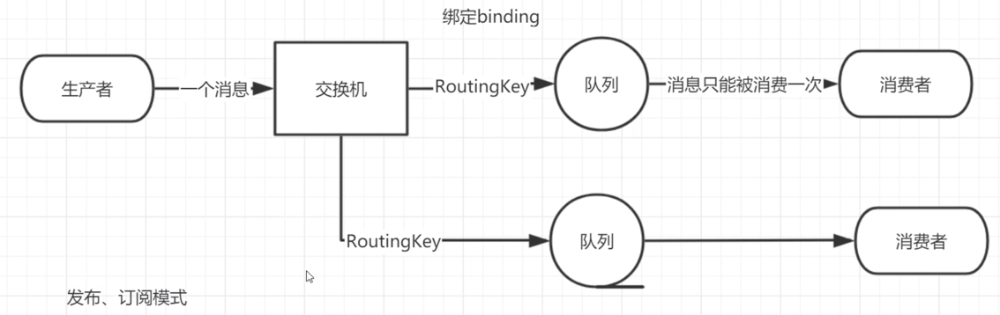
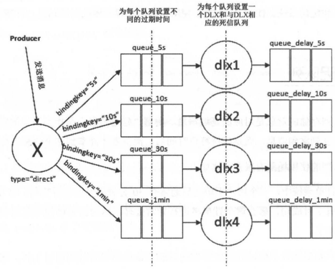
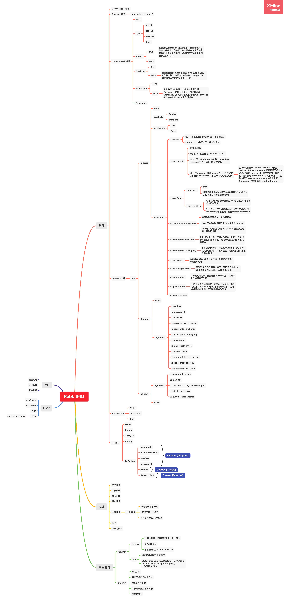

## 工作原理


### 安装

```bash
docker run -d -it --rm --name rabbitmq -p 5672:5672 -p 15672:15672 rabbitmq:3.10-management
```

##### Work queues 工作模式


##### Publish/Subscribe 发布订阅




##### Routing 路由


###### Direct exchange


###### Multiple bindings


###### Routing Model


##### Topics


```text
quick.orange.rabbit  -> Q1 Q2
lazy.orange.elephant -> Q1 Q2
quick.orange.fox     -> Q1
lazy.red.fox         -> Q2
lazy.pink.rabbit     -> Q2 [队列只接受一次]
quick.orange.male.rabbit -> None
lazy.orange.male.rabbit  -> Q2
```

- 队列绑定#那么队列将接受所有的数据，类似fanout
- 队列绑定中没有出现#和*出现，队列绑定类型就是direct

#### 死信队列

> 定义：DLX ，全称为 Dead-Letter-Exchange ，可以称之为死信交换器，也有人称之为死信邮箱。当 消息在一个队列中变成死信 (dea message) 之后，它能被重新被发送到另一个交换器中，这个 交换器就是 DLX ，绑定 DLX 的队列就称之为死信队列。

##### 架构

---

---


##### 意义

```text
DLX一个非常有用的特性,它可以处理异常情况下，消息不能够
被消费者正确消费(消费者调用了 Basic.Nack 或者 Basic.Reject) 而被置入死信队列中
的情况，后续分析程序可以通过消费这个死信队列中的内容来分析当时所遇到的异常情况，进
而可以改善和优化系统。
```

##### Demo

See rabbitmqdocs.dlxs

#### 延迟队列

> 延迟队列存储的对象是对应的延迟消息，所谓"延迟消息"是指当消息被发送以后，并不 想让消费者立刻拿到消息，而是等待特定时间后，消费者才能拿到这个消息进行消费

##### 应用场景

1. 预定会议
2. 用户下单10分钟未支付
3. 发货2天后提醒
4. 手机远程遥控家里电器

##### 替代品

定时轮训

##### 架构



##### Demo


#### 优先级队列

##### 应用场景

##### 架构

##### Demo


# END

